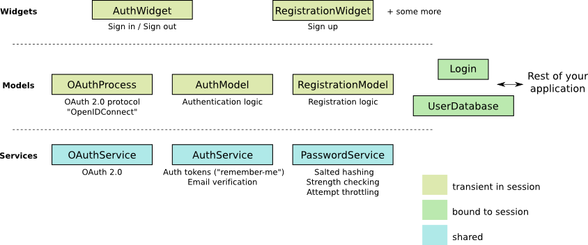

# Wt::Auth简介

## 先决条件

在本教程中，我们使用一个例子作为Wt认证模块的实践介绍。这个例子包含在Wt发行版中，在examples/feature/auth1中。

本介绍假定你对Wt本身，特别是它的有状态会话模型和widget概念有一定的了解。如果你还没有这样做，你可能想先看一下Wt的教程。

## 绪论

认证模块实现了让用户在你的应用程序上注册，并让他们登录的逻辑和部件。请注意，这个模块是完全可选的，它只是在Wt的基础上实现。

该模块实现了认证。它的主要目的是安全地验证一个用户登录到你的应用程序。在你的应用程序中，你将使用Wt::Auth::Login对象与认证模块交互，你通常在你的应用程序对象中持有该对象。它表示当前登录的用户（如果有的话），并传播认证事件。

你如何使用这些信息进行授权或定制用户体验，不在本模块的范围之内。由于Wt的内置安全功能，以及强大的会话劫持缓解功能，这就像人们可以想象的那样直接。

目前，该模块提供以下功能，可以单独启用、配置或定制：

* 密码认证，使用最佳做法，包括使用强加密哈希函数（如bcrypt）的盐化哈希和密码强度检查。
* 记住我的功能，再次使用最佳实践，将存储在cookies中的认证令牌与用户联系起来。
* 使用典型的确认邮件程序验证了电子邮件地址。
* 丢失密码功能，使用验证的电子邮件地址提示用户输入新密码。
* 使用第三方身份提供商进行认证，目前使用OAuth 2，支持每个用户的多个身份。目前，只支持谷歌和Facebook的认证，但Wt将来可能会支持其他OAuth 2提供商，如标准化的OpenIDConnect。
* 注册逻辑，其中也包括将新的（联合登录）身份合并到现有的用户资料中所需要的逻辑。例如，如果一个用户以前使用用户名和密码注册，他后来也可以使用例如他的谷歌账户进行认证，这个新的身份将被添加到他现有的账户中。

这些功能的逻辑是与用户界面组件分开实现的，用户界面组件可以定制或完全用你自己的小部件取代。

除了传统的基于密码的认证，我们一直小心翼翼地设计，以适应第三方身份提供者（联合登录），如谷歌、Twitter、Facebook等......以及其他一般的认证机制（认证反向代理、客户端SSL证书、LDAP、令牌设备......）。

很明显，认证逻辑需要与存储系统对话，它被设计为使用一个抽象接口与存储系统挂钩。我们提供了一个利用Wt::Dbo（Wt的ORM）的默认实现。

## 模块组织

下图说明了模块的主要类别。



它在模型类和视图类（即小部件）之间使用了经典的分离。

模型类分为三种类型：

* 服务类被设计成在所有会话中共享（除了配置外，它们没有任何状态）。它们包含的逻辑不需要会话中的瞬时状态。
* 会话绑定的模型类通常在会话的整个生命周期中保持在会话中（但不需要）。
* 瞬时模型类在用户界面中起着积极的作用，并在某些视图组件的上下文中被实例化。它们实现的逻辑涉及用户在登录和注册过程中的状态。

## 范例

我们将通过一个小例子，这是一个使用认证模块的基本应用（包含在Wt发行版的examples/feature/auth1中）。它是大约200行的C++语言（我们将在下面讨论），有以下特点。

* 基于密码的认证和注册
* OAuth-2登录和注册，用于谷歌和Facebook账户
* 密码尝试限制
* 电子邮件验证和密码丢失程序
* 记住我的令牌
* 凭借Wt本身，如果浏览器不支持Ajax、强大的安全性、垃圾邮件的抵御能力等，就会退回到普通HTML行为。

这个例子应该可以帮助你了解如何在一个新的或现有的Wt项目中添加认证支持。

### 设置用户数据库

我们将使用Wt::Dbo的认证数据库的默认实现，以及默认的认证持久化类。这个数据库的实现可以在Wt::Auth::Dbo::UserDatabase中找到，它使用Wt::Auth::Dbo::AuthInfo作为认证信息的持久化类，它本身引用了另外两个持久化类：

* 一个用户的 "身份 "被存储在一个单独的表中。一个身份可以唯一地识别一个用户。传统上，一个用户只有一个身份，就是他的登录名（可以是他的电子邮件地址）。但是，一个用户可以积累更多的身份，对应于第三方身份提供者的账户。通过允许多个身份，用户可以使用多种方法进行识别。一个用户的 "身份 "被存储在一个单独的表中。一个身份可以唯一地识别一个用户。传统上，一个用户只有一个身份，就是他的登录名（可以是他的电子邮件地址）。但是，一个用户可以积累更多的身份，对应于第三方身份提供者的账户。通过允许多个身份，用户可以使用多种方法进行识别。
* 认证令牌被存储在一个单独的表中。一个认证令牌通常对应于一个 "记住我 "的cookie，一个用户在使用不同的电脑时可能有多个 "记住我 "的cookie。

此外，我们定义了一个用户类型，我们可以将特定用户的应用数据添加到该类型中（这可能是地址信息、出生日期、偏好、用户角色等），并且我们要将其与认证系统连接起来。

下面给出了（目前为空）用户类型的定义和持久化映射：

**User.h**

```cpp
#include <Wt/Dbo/Types.h>
#include <Wt/WGlobal.h>

namespace dbo = Wt::Dbo;

class User;
using AuthInfo = Wt::Auth::Dbo::AuthInfo<User>;

class User {
public:
  template<class Action>
  void persist(Action& a)
  {
  }
};

DBO_EXTERN_TEMPLATES(User)
```

我们为AuthInfo声明一个类型别名，它将认证信息持久化类与我们自定义的用户信息持久化类联系起来。

接下来，我们定义一个会话类，它封装了与数据库的连接，以存储认证信息，它也跟踪当前登录的用户，在一个Web会话中。我们选择使用Wt::Dbo::Session类作为基类（它也可以是一个嵌入的成员）。

稍后，我们将看到每个Web会话将如何实例化它自己的持久化/认证会话对象。

**Session.h**

```cpp
#include <Wt/Auth/Login.h>
#include <Wt/Auth/UserDatabase.h>

#include <Wt/Dbo/Session.h>
#include <Wt/Dbo/ptr.h>

#include "User.h"

namespace dbo = Wt::Dbo;

using UserDatabase = Wt::Auth::Dbo::UserDatabase<AuthInfo>;

class Session : public dbo::Session
{
public:
  Session(const std::string& sqliteDb);

  Wt::Auth::AbstractUserDatabase& users();
  Wt::Auth::Login& login() { return login_; }

  ...

private:
  std::unique_ptr<UserDatabase> users_;
  Wt::Auth::Login login_;

  ...
};
```

注意UserDatabase的类型别名，它指出我们将使用Wt::Auth::Dbo::UserDatabase的实现，使用AuthInfo，我们在前面为它声明了一个类型别名。当然，你可以自由地为Wt::Auth::AbstractUserDatabase提供另一种不是基于Wt::Dbo的实现。

我们还在这里嵌入了一个Wt::Auth::Login成员，它是一个小型的模型类，用于保存当前的登录信息。登录/注销小工具将操纵这个登录对象，而我们应用程序的其他部分将监听来自这个对象的登录变化，以适应当前登录的用户。

Session 构造函数设置数据库会话。

**Session.C**（构造函数）

```cpp
#include "Session.h"
#include "User.h"

#include "Wt/Auth/Dbo/AuthInfo.h"

#include "Wt/Dbo/backend/Sqlite3.h"

using namespace Wt;

Session::Session(const std::string& sqliteDb)
{
  auto connection = std::make_unique<Dbo::backend::Sqlite3>(sqliteDb);
  setConnection(std::move(connection_));

  mapClass<User>("user");
  mapClass<AuthInfo>("auth_info");
  mapClass<AuthInfo::AuthIdentityType>("auth_identity");
  mapClass<AuthInfo::AuthTokenType>("auth_token");

  try {
    createTables();
    std::cerr << "Created database." << std::endl;
  } catch (Wt::Dbo::Exception& e) {
    std::cerr << e.what() << std::endl;
    std::cerr << "Using existing database";
  }

  users_ = std::make_unique<UserDatabase>(*this);
}
```

这个例子使用了一个SQLite3数据库（一个方便开发的可爱的数据库），我们将四个持久化类映射到表。

然后，如果需要，我们创建数据模式，这将自动发出以下SQL。

```sql
create table "user" (
  "id" integer primary key autoincrement,
  "version" integer not null
)

create table "auth_info" (
  "id" integer primary key autoincrement,
  "version" integer not null,
  "user_id" bigint,
  "password_hash" varchar(100) not null,
  "password_method" varchar(20) not null,
  "password_salt" varchar(20) not null,
  "status" integer not null,
  "failed_login_attempts" integer not null,
  "last_login_attempt" text,
  "email" varchar(256) not null,
  "unverified_email" varchar(256) not null,
  "email_token" varchar(64) not null,
  "email_token_expires" text,
  "email_token_role" integer not null,
  constraint "fk_auth_info_user" foreign key
   ("user_id") references "user" ("id")
   on delete cascade deferrable initially deferred
)

create table "auth_token" (
  "id" integer primary key autoincrement,
  "version" integer not null,
  "auth_info_id" bigint,
  "value" varchar(64) not null,
  "expires" text,
  constraint "fk_auth_token_auth_info" foreign key
   ("auth_info_id") references "auth_info" ("id")
   on delete cascade deferrable initially deferred
)

create table "auth_identity" (
  "id" integer primary key autoincrement,
  "version" integer not null,
  "auth_info_id" bigint,
  "provider" varchar(64) not null,
  "identity" varchar(512) not null,
  constraint "fk_auth_identity_auth_info" foreign key
   ("auth_info_id") references "auth_info" ("id")
   on delete cascade defferable initially deferred
)
```

注意auth_info、auth_token和auth_identity表，它们定义了我们认证系统的存储。

### 配置认证

服务类（Wt::Auth::AuthService, Wt::Auth::PasswordService, and Wt::Auth::OAuthService），可以在会话之间共享，并包含配置和逻辑，不需要瞬时会话状态。

添加这些服务类的一个很好的位置是在一个专门的Wt::WServer实例内，通常你在一个Wt进程中也只有一个。你也可以为它们创建一个单子。为了使这个例子简单，我们将把它们简单地声明为全局变量（但在文件范围内）：myAuthService、myPasswordService和myOAuthServices。

**Session.C**（认证服务）

```cpp
#include "Wt/Auth/AuthService.h"
#include "Wt/Auth/HashFunction.h"
#include "Wt/Auth/PasswordService.h"
#include "Wt/Auth/PasswordStrengthValidator.h"
#include "Wt/Auth/PasswordVerifier.h"
#include "Wt/Auth/GoogleService.h"
#include "Wt/Auth/FacebookService.h"

namespace {
  Wt::Auth::AuthService myAuthService;
  Wt::Auth::PasswordService myPasswordService{myAuthService};
  std::vector<std::unique_ptr<Wt::Auth::OAuthService>> myOAuthServices;
}

void Session::configureAuth()
{
  myAuthService.setAuthTokensEnabled(true, "logincookie");
  myAuthService.setEmailVerificationEnabled(true);
  myAuthService.setEmailVerificationRequired(true);

  std::unique_ptr<Wt::Auth::PasswordVerifier> verifier =
    std::make_unique<Wt::Auth::PasswordVerifier>();
  verifier->addHashFunction(std::make_unique<Wt::Auth::BCryptHashFunction>(7));
  myPasswordService.setVerifier(std::move(verifier));
  myPasswordService.setAttemptThrottlingEnabled(true);
  myPasswordService.setStrengthValidator(std::make_unique<Wt::Auth::PasswordStrengthValidator>());

  if (Wt::Auth::GoogleService::configured())
    myOAuthServices.push_back(std::make_unique<Wt::Auth::GoogleService>(myAuthService));

  if (Wt::Auth::FacebookService::configured())
    myOAuthServices.push_back(std::make_unique<Wt::Auth::FacebookService>(myAuthService));

  for (unsigned i = 0; i < myOAuthServices.size(); ++i)
    myOAuthServices[i]->generateRedirectEndpoint();
}

Wt::Auth::AbstractUserDatabase& Session::users()
{
  return *users_;
}

const Wt::Auth::AuthService& Session::auth()
{
  return myAuthService;
}

const Wt::Auth::PasswordService& Session::passwordAuth()
{
  return myPasswordService;
}

const std::vector<const Wt::Auth::OAuthService *>& Session::oAuth()
{
  std::vector<const Wt::Auth::OAuthService *> result;
  for (auto &auth : myOAuthServices) {
    result.push_back(auth.get());
  }
  return result;
}
```

Wt::Auth::AuthService被配置为支持 "remember-me "功能，以及电子邮件验证。

Wt::Auth::PasswordService需要一个哈希函数来安全存储密码。你实际上可以定义一个以上的哈希函数，这只有在你想迁移到一个新的哈希函数，同时仍然支持现有的密码时才有用。当一个用户登录时，如果他没有使用 "首选 "的哈希函数，他的密码就会被用首选的哈希函数重新修改。在这个例子中，我们将使用bcrypt，它被包含在Wt::Auth中作为一个哈希函数。

我们还启用了密码尝试节流功能：这可以减轻强行猜测密码的尝试。

最后，我们还使用了两个（但以后可能更多）Wt::Auth::OAuthService类。你需要为每个身份提供者提供一个服务。在这种情况下，我们添加谷歌和Facebook作为身份提供者。

### 用户界面

我们创建了一个专门的Wt::WApplication，其中包含我们的认证会话，并实例化了一个Wt::Auth::AuthWidget。这个Widget显示了一个登录或注销表单（取决于登录状态），并且还钩住了注册、丢失密码和处理URL中的电子邮件发送的令牌的默认表单）。

**User interface**

```cpp
#include <Wt/WApplication.h>
#include <Wt/WBootstrapTheme.h>
#include <Wt/WContainerWidget.h>
#include <Wt/WServer.h>

#include <Wt/Auth/AuthWidget.h>
#include <Wt/Auth/PasswordService.h>

#include "model/Session.h"

class AuthApplication : public Wt::WApplication
{
public:
  AuthApplication(const Wt::WEnvironment& env)
    : Wt::WApplication(env),
      session_(appRoot() + "auth.db")
  {
    session_.login().changed().connect(this, &AuthApplication::authEvent);

    root()->addStyleClass("container");
    setTheme(std::make_shared<Wt::WBootstrapTheme>());

    useStyleSheet("css/style.css");

    std::unique_ptr<Wt::Auth::AuthWidget> authWidget =
      std::make_unique<Wt::Auth::AuthWidget>(Session::auth(), session_.users(), session_.login());

    authWidget->model()->addPasswordAuth(&Session::passwordAuth());
    authWidget->model()->addOAuth(Session::oAuth());
    authWidget->setRegistrationEnabled(true);

    authWidget->processEnvironment();

    root()->addWidget(std::move(authWidget));
  }

  void authEvent() {
    if (session_.login().loggedIn()) {
      const Wt::Auth::User& u = session_.login().user();
      log("notice")
        << "User " << u.id()
        << " (" << u.identity(Wt::Auth::Identity::LoginName) << ")"
        << " logged in.";
    } else
      log("notice") << "User logged out.";
  }

private:
  Session session_;
};
```

最后一部分是我们的主要功能，我们在这里设置应用服务器：

**应用服务器设置**

```cpp
std::unique_ptr<Wt::WApplication> createApplication(const Wt::WEnvironment &env)
{
  return std::make_unique<AuthApplication>(env);
}

int main(int argc, char **argv)
{
  try {
    Wt::WServer server{argc, argv, WTHTTP_CONFIGURATION};

    server.addEntryPoint(Wt::EntryPointType::Application, createApplication);

    Session::configureAuth();

    server.run();
  } catch (Wt::WServer::Exception& e) {
    std::cerr << e.what() << std::endl;
  } catch (Wt::Dbo::Exception &e) {
    std::cerr << "Dbo exception: " << e.what() << std::endl;
  } catch (std::exception &e) {
    std::cerr << "exception: " << e.what() << std::endl;
  }
}
```
