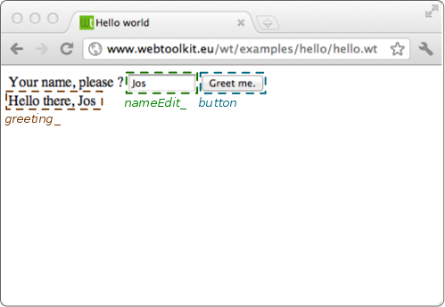
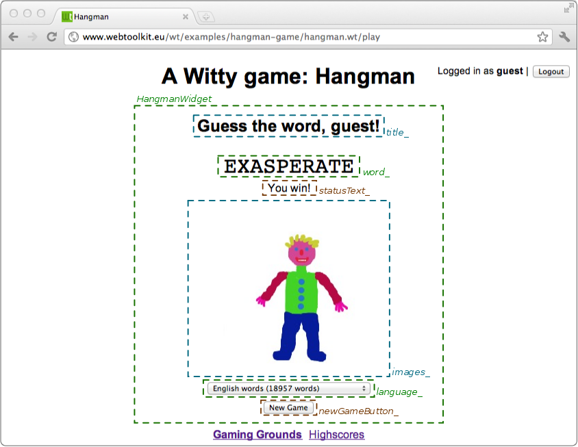
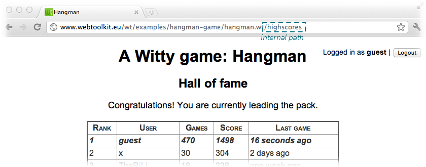

# Wt编程实战

## 绪论

Wt是一个用于开发网络应用的C++库。诚然，当人们谈到网络开发时，C++并没有作为编程语言的第一选择出现在脑海中。网络开发通常与脚本语言有关，并且通常在为传入的请求生成响应的层面上实现。由于请求和响应都是文本编码，网络编程最终是一项文本处理任务，因此方便地用脚本语言来表达。

然而，从功能的角度来看，作为一项编程任务，现代的网络应用程序更像一个桌面应用程序：它是高度互动的，不再以页面的形式组织起来（也许仍然是概念上的，但不是实际上的）。与服务器的互动越来越多地发生在后台，而不是完全刷新页面。事实上，浏览器正在转变为一个应用程序的平台，在这个平台上，用户与数据进行互动，而且更多的是相互间的互动。

虽然有些开发者选择用JavaScript实现应用程序，并使用客户端-服务器协议来访问服务器端资源，但这有很多固有的缺点。你需要放开静态类型（或添加另一层，如GWT）。由编译器强制执行的类型安全，随着项目的复杂性和开发人员数量的增加是非常宝贵的。此外，你需要设计一个客户端-服务器协议，并尽量减少通信和相关的往返延迟。最后，这种方法不能适用于需要满足可访问性准则或需要搜索引擎优化的应用程序，因此需要一个纯HTML版本的应用程序。Wt作为一个服务器端的解决方案，克服了这些问题，而且与JavaScript应用程序相比，几乎没有互动性的损失。

与其他服务器端方法相比，Wt的主要优势在于它的widget抽象性。一个应用程序被定义为一个小部件的层次结构。其中一些widget是通用的，由库提供（如按钮、行编辑、表视图......），其他的则是为特定的应用而专门设计的（例如，整个博客widget）。一个小组件封装了视图和行为方面，消耗和产生事件，也参与URL处理，并可能与其他HTTP资源互动。更常见的是，一个部件将实际的 "逻辑 "委托给一个模型，这种分层方法通常被称为MVC。与页面或 "部件 "不同，部件是现代网络应用的一个真正可重复使用、可定制和可扩展的构件（作为面向对象编程的一个典型例子）。实际的请求处理和渲染是抽象的，其好处是可以根据配置和浏览器属性使用完整的页面渲染模型（纯HTML）或增量更新（Ajax/WebSockets）。

虽然是用C++实现的，但Wt的主要重点或新颖之处不是它的性能，而是它专注于开发可维护的应用程序和它广泛的内置小工具库。但由于它在嵌入式系统中很受欢迎并被广泛使用，你会发现它的性能和足迹也得到了优化，这是因为它有一个无意义的API、周到的架构和C++的...

在本教程中，我们将使用两个小程序来说明如何使用Wt来创建Web应用程序。在本教程结束后，你应该很好地掌握了Wt的可能性，Wt应用程序是如何建立的，以及它是如何为你提供一个管理复杂性的工具。

第一个应用程序是强制性的Hello World应用程序，介绍了该库的两个关键概念：创建和更新widget树以及对用户输入的反应。第二个稍大的应用程序是经典的刽子手游戏。这两个应用程序都包含在Wt源码发行版中。

但在我们深入研究之前，让我们快速浏览一下该库的主要概念。

## 主要组件

### 部件

在浏览器窗口中呈现的用户界面，是通过创建和维护一个部件树来指定的。每个widget对应于用户界面的一个矩形部分，并管理其内容和行为。在核心方面，该库在一个会话中负责两个任务。(1)在网络浏览器中以HTML/JavaScript的形式渲染这个widget树，并以增量更新的形式跟踪变化，(2)同步用户输入并将事件从浏览器转发到这些widget。

由于使用widget树的 用户界面 规范和树的渲染之间的明确分离，该库在Ajax可用时实现了一些渲染的优化。库不仅可以增量更新界面，还有其他一些技巧，比如在响应事件（或初始加载）时只渲染可见的部件变化，并在后台渲染隐藏部件的变化。因此，初始响应得到了优化，随后的小部件的出现也显得很迅速。

### 会话管理和生命周期

另一个完全由该库处理的方面是会话管理。对于每一个新的会话（相当于一个新的用户访问你的网络应用），库都会创建一个新的WApplication对象。作为一个开发者，你几乎可以把一个应用程序作为一个单用户应用程序来实现，除非你让用户与一个共同的组件（如数据库）或相互之间进行交互，为此必须使用标准数据共享机制。

根据部署模式，该库将把会话映射到专用或共享进程上。当使用专用进程时，为每个不同的会话创建一个新的进程：这提供了不同会话的内核级隔离，这对于高度安全敏感的应用程序可能是有用的。当使用共享进程时，新的会话被随机分配到库的一个可用进程中。这减少了DoS攻击的危险，但需要更谨慎的编程，因为内存损坏会影响到一个进程中的所有会话，而且会话不是由任何其他机制而是由正确的编程隔离的。

Wt使用客户端和服务器之间的保持连接协议来确定会话的寿命。只要网页在用户的浏览器中显示，会话就会保持活力。当用户关闭他的窗口、导航离开，或者在连接丢失的超时后，会话被终止。当一个会话被终止时，应用程序对象和整个小部件树被删除，因此你应该在这些对象的析构器中释放你的小部件或应用程序所持有的资源。

### 部署

有几个部署选项可供选择：

* wthttp连接器库实现了一个实现HTTP(S)和WebSockets的webserver。它不仅在开发过程中很方便，而且对于从小型嵌入式系统或移动设备到多服务器的部署都是一个有效的解决方案。
* wtfcgi 连接器库实现了 FastCGI 协议。它允许Wt应用程序被集成到现有的Web服务器（如Apache、Lighttpd或Nginx）。
* wtisapi连接器库实现了ISAPI协议。在Windows平台上，它允许Wt应用程序集成到微软互联网信息服务器（IIS）。

## 你好 , Wt

在这个例子中，我们展示了一个提示用户输入姓名的应用程序。当他按下按钮时，问候语的文字会根据输入的名字进行更新.



一个新的会话从创建一个**WApplication**类的实例开始。这个对象管理着widget树的根，并包含其他会话信息，如连接的浏览器的能力。

> 这些例子假设你使用的是支持C++14的编译器。如果你只能使用使用C++11，你可以使用Wt::cpp14::make_unique而不是std::make_unique。

### 一个完整的 "Hello Word"应用程序

```cpp
#include <Wt/WApplication.h>
#include <Wt/WBreak.h>
#include <Wt/WContainerWidget.h>
#include <Wt/WLineEdit.h>
#include <Wt/WPushButton.h>
#include <Wt/WText.h>

class HelloApplication : public Wt::WApplication
{
public:
    HelloApplication(const Wt::WEnvironment& env);

private:
    Wt::WLineEdit *nameEdit_;
    Wt::WText *greeting_;
};

HelloApplication::HelloApplication(const Wt::WEnvironment& env)
    : Wt::WApplication(env)
{
    setTitle("Hello world");

    root()->addWidget(std::make_unique<Wt::WText>("Your name, please? "));
    nameEdit_ = root()->addWidget(std::make_unique<Wt::WLineEdit>());
    Wt::WPushButton *button = root()->addWidget(std::make_unique<Wt::WPushButton>("Greet me."));
    root()->addWidget(std::make_unique<Wt::WBreak>());
    greeting_ = root()->addWidget(std::make_unique<Wt::WText>());
    auto greet = [this]{
      greeting_->setText("Hello there, " + nameEdit_->text());
    };
    button->clicked().connect(greet);
}

int main(int argc, char **argv)
{
    return Wt::WRun(argc, argv, [](const Wt::WEnvironment& env) {
      return std::make_unique<HelloApplication>(env);
    });
}
```

如果你愿意，你可以在本地构建和运行这个应用程序。你所需要做的就是编译上面的代码，并与Wt库（libwt）和内置的HTTP服务器（libwthttp）链接。

在类 UNIX 系统上，您可以执行以下操作：

```bash
$ g++ -std=c++14 -o hello hello.cc -lwthttp -lwt
$ ./hello --docroot . --http-address 0.0.0.0 --http-port 9090
```

> 如果你在第一步中得到链接错误，你可能需要添加更多的库。
>
> ```bash
> $ g++ -std=c++14 -o hello hello.cc -I/usr/local/include -L/usr/local/lib
>   -lwthttp -lwt -lboost_system -lboost_thread -lboost_filesystem
>   -lboost_program_options
> ```

让我们从应用程序的最后部分开始，即main()函数。

在main()函数中，我们调用WRun()来启动应用服务器。这个方法将在应用服务器关闭时返回（通过捕捉TERM信号或Windows的对应信号）。

> **WRun()内部**
> WRun()实际上是一个方便的函数，它创建并配置了一个WServer实例。如果你想要更多的控制，例如你有多个 "入口点"，或者想要控制服务器的启动和停止，你可以直接使用WServer API来代替。

WRun()函数传递argc和argv（对于某些连接器，如内置的webserver配置服务器），并接受一个函数对象作为最后的参数。当一个新的会话被启动时，这个函数将被调用，并为该会话返回一个新的WApplication实例。这个函数又有一个WEnvironment对象作为输入，这个对象可以用来定制应用程序或验证用户。

这个例子在应用程序的根容器中实例化了四个部件：一个文本（"请说出你的名字？"），一个行编辑（nameEdit_），一个空文本（greeting_）和一个按钮（button）。这三种类型的部件是库中提供的通用部件，直接映射到本地HTML元素。在下面的刽子手例子中，我们将看到其他自定义和更专业的部件是如何以完全相同的方式使用的。

在我们实例化了部件之后，我们指定我们要对点击按钮做出反应。我们把按钮的clicked()信号连接到greet函数上。事件通过信号从一个widget（按钮）传播到其他widget，或者像本例中的应用程序对象。瞥一眼小组件的参考文档，就会发现一个特定的小组件所暴露的信号。对于基本的部件，如一个按钮，这些是典型的鼠标和键盘事件。更高级别的小组件可能会公布其他事件（例如，日历小组件）有一个selectionChanged()信号），你可以将事件添加到你自己的自定义小组件。

> **事件传播是如何进行的**
> 当一个事件被用户触发时，网络浏览器将目标对象和相应的信号以及所有的表单数据传达给网络服务器（使用全页面刷新或Ajax/WebSockets）。在服务器上，在请求被验证为真实后，表格数据如行编辑文本首先被处理以更新部件树状态。然后，通过从目标部件发出信号来传播事件，将事件传播到所有连接的方法，例如在我们的例子中，问候函数。对widget树的修改被跟踪，在事件被处理后，这些变化被反映在渲染的HTML DOM树上，再次使用全页面刷新或使用Ajax或WebSockets增量。

实现greet方法最有趣的地方可能是不存在的代码：没有使用DOM操作更新文本或重新渲染页面的JavaScript，没有使用Ajax或WebSockets发布事件和行编辑值的JavaScript代码，没有解释行编辑值或按钮事件的HTTP请求解码，也没有安全相关代码。所有这些都是由库来处理的。虽然这对这样一个小例子来说还是可以管理的，但想象一下这样的情况：页面包含与不同任务相关的各种表单元素，因此由不同的小部件管理，在事件传播期间，许多不相关的小部件被更新。

## Hangman

对于那些忘记了刽子手游戏玩法的人来说：挑战是猜测一个单词。你可以选择一个字母，一次一个。如果该词包含所选的字母，就会在正确的位置显示出来。如果这个词不包含这个字母，你就会失去一个回合，离被吊死更近一步。为了获胜，你需要在被吊死之前找到这个词。在我们的版本中，我们将让用户选择一本字典（英语或荷兰语），并跟踪用户和他的高分。

### 第一个自定义小部件

我们首先讨论HangmanWidget，它是一个封装了游戏本身的自定义部件：它允许用户玩一个或多个游戏。它并不处理更新用户的分数，而是使用一个信号将分数更新事件指示给其他部件。

下面的截图显示了小部件是如何由不同的小部件组成的。



HangmanWidget结合了由库提供的部件（WText: title_, statusText_, WComboBox: language_）和三个自定义部件（WordWidget: word_, ImagesWidget: images_ 和 LettersWidget: letters）。正如你将看到的，自定义部件的实例化和使用方式与库部件基本相同，包括对这些部件产生的事件做出反应。

有了这些信息，我们就可以实现类的定义。

###### **HangmanWidget 声明**

```bash
class HangmanWidget : public Wt::WContainerWidget
{
public:
    HangmanWidget(const std::string &name);

    Wt::Signal<int>& scoreUpdated() { return scoreUpdated_; }

private:
    Wt::WText        *title_;
    WordWidget       *word_;
    ImagesWidget     *images_;
    LettersWidget    *letters_;
    Wt::WText        *statusText_;
    Wt::WComboBox    *language_;
    Wt::WPushButton  *newGameButton_;

    Wt::Signal<int>   scoreUpdated_;

    std::string       name_;
    int               badGuesses_;

    void registerGuess(char c);
    void newGame();
};
```

这个小部件被实现为一个专门的WContainerWidget。这是一个典型的选择，用于在一个简单的布局中结合其他小部件的小部件。我们声明了一个公共方法scoreUpdated()，它提供了对信号的访问，该信号将被用来指示用户在玩游戏时的分数变化。这里使用的Signal `<int>`，表示将传递一个整数值作为事件信息，并将反映分数更新本身（当用户获胜时为正数，当用户失败时为负数）。任何具有与信号兼容的签名的函数或对象方法都可以连接到它，并将接收分数更新。

类声明的私有部分持有对所含小部件的引用，以及与游戏有关的状态。

构造函数的实现与我们之前讨论的hello world应用程序有一些相似之处：小部件被实例化，事件信号被绑定。然而，也有一些新奇之处。

###### HangmanWidget 构造函数

```cpp
using namespace Wt;

HangmanWidget::HangmanWidget(const std::string &name)
    : name_(name),
      badGuesses_(0)
{
    setContentAlignment(AlignmentFlag::Center);

    title_ = addWidget(std::make_unique<WText>(tr("hangman.readyToPlay")));

    word_ = addWidget(std::make_unique<WordWidget>());
    statusText_ = addWidget(std::make_unique<WText>());
    images_ = addWidget(std::make_unique<ImagesWidget>(MaxGuesses));

    letters_ = addWidget(std::make_unique<LettersWidget>());
    letters_->letterPushed().connect(this, &HangmanWidget::registerGuess);

    language_ = addWidget(std::make_unique<WComboBox>());
    language_->addItem(tr("hangman.englishWords").arg(18957));
    language_->addItem(tr("hangman.dutchWords").arg(1688));

    addWidget(std::make_unique<WBreak>());

    newGameButton_ = addWidget(std::make_unique<WPushButton>(tr("hangman.newGame")));
    newGameButton_->clicked().connect(this, &HangmanWidget::newGame);

    letters_->hide();
}
```

Wt支持不同的技术来布局小工具，这些小工具可以被组合起来（也可以参见侧边栏）：即带有CSS布局的小工具，带有CSS布局的HTML模板，或者布局管理器。在这里，我们选择使用第一种方法，因为我们只是想把所有的东西都竖直放在中间。

> **其他布局选项**
> 尽管布局管理器在GUI开发中是一个熟悉的概念，但在Web开发中，CSS是布局之王。但有些事情用CSS是很难做到的，特别是垂直居中或垂直尺寸调整。正是为了这个目的，布局管理器被添加到Wt中。这些布局管理器使用JavaScript，根据其他小部件的尺寸来计算小部件的宽度和/或高度。 
> 从Wt 4开始，一些布局默认使用CSS和flexbox，这在很多情况下是可行的，但在某些情况下，你可能想选择JavaScript的实现来代替。

LetterWidget暴露了一个信号，表明用户选择了一个字母。我们给它连接一个私有方法registerGuess()，它实现了处理字母选择的游戏逻辑。请注意，这种对自定义部件的事件处理与对来自按钮的事件的反应没有什么不同，这使得该部件与库所提供的部件一样可以重复使用（假设你从事的是挂牌游戏的业务）。

为了支持国际化，我们使用tr("key")函数（这实际上是WWidget的一个方法，它调用WString::tr()，来查询一个给定键的（本地化的）字符串。这发生在一个消息资源包中（见WMessageResourceBundle），它包含这些字符串的本地特定值。值可以用"{x}"符号和WString的arg()方法在这些字符串中替换，例如用于 "hangman.englishWords "字符串，它的实际英文值是 "English words({1} words)"。

为了完整起见，我们在下面展示HangmanWidget的其余实现。

HangmanWidget：游戏逻辑实现

```cpp
void HangmanWidget::newGame()
{
    WString title(tr("hangman.guessTheWord"));
    title_->setText(title.arg(name_));

    language_->hide();
    newGameButton_->hide();

    Dictionary dictionary = (Dictionary) language_->currentIndex();
    word_->init(RandomWord(dictionary));
    letters_->reset();
    badGuesses_ = 0;
    images_->showImage(badGuesses_);
    statusText_->setText("");
}

void HangmanWidget::registerGuess(char c)
{
    if (badGuesses_ < MaxGuesses) {
      bool correct = word_->guess(c);

      if (!correct) {
          ++badGuesses_;
          images_->showImage(badGuesses_);
      }
    }

    if (badGuesses_ == MaxGuesses) {
        WString status = tr("hangman.youHang");
        statusText_->setText(status.arg(word_->word()));

        letters_->hide();
        language_->show();
        newGameButton_->show();

        scoreUpdated_.emit(-10);
    } else if (word_->won()) {
        statusText_->setText(tr("hangman.youWin"));
        images_->showImage(ImagesWidget::HURRAY);

        letters_->hide();
        language_->show();
        newGameButton_->show();

        scoreUpdated_.emit(20 - badGuesses_);
    }
}
```

### 释放（部分）Wt 的力量

到目前为止，我们介绍了一种相当独特的开发网络应用程序的方式，以及一个强大的重复使用的构件：widget。我们要解决的刽子手游戏中的下一个widget，是我们刚才已经使用过的：ImagesWidget。它说明了库的一个重要方面，它高度增强了有Ajax会话的用户的用户体验（这应该是你的大多数用户）。像Google的Gmail和Google Maps这样流行的网络应用的最吸引人的特点之一是出色的响应时间。Google可能在开发客户端JavaScript和Ajax代码方面花费了相当大的精力来实现这一点。几乎不费吹灰之力--实际上几乎是自动的--你就可以用Wt获得类似的响应速度，事实上，该库也将使用类似的技术来实现这一目标。使用Wt的一个好处是，当Ajax或JavaScript支持不可用时，应用程序仍然可以正常运行。我们接下来要讨论的ImagesWidget类，就包含了其中的一些技术。隐藏的小部件被浏览器预取，准备在调用show()时显示出来。

#### ImagesWidget：实现

```cpp
ImagesWidget::ImagesWidget(int maxGuesses)
{
    for (int i = 0; i <= maxGuesses; ++i) {
        std::string fname = "icons/hangman";
        fname += std::to_string(i) + ".jpg";
        WImage *theImage = addWidget(std::make_unique<WImage>(fname));
        images_.push_back(theImage);

        theImage->hide();
    }

    WImage *hurray = std::make_unique<WImage>("icons/hangmanhurray.jpg");
    hurray->hide();
    images_.push_back(hurray);

    image_ = 0;
    showImage(maxGuesses);
}

void ImagesWidget::showImage(int index)
{
    image(image_)->hide();
    image_ = index;
    image(image_)->show();
}

WImage *ImagesWidget::image(int index) const
{
    return index == HURRAY ? images_.back() : images_[index];
}
```

在构造函数中，我们又见到了库中的一个基本部件。WImage，不出所料，它与HTML中的图像相对应。这段代码显示了如何创建对应于刽子手例子的每个状态的部件，并将其添加到我们的ImagesWidget中，该部件专门用于WContainerWidget。每张图片也是隐藏的--我们希望一次只显示一张，这在showImage()函数中实现。

但是为什么我们创建这些图像只是为了隐藏它们？一个有效的替代方法可能是简单地创建我们想要显示的 WImage 并删除前一个，或者更好的是，简单地操作图像以指向另一个 URL？差异与响应时间有关，至少在 Ajax 可用时是这样。该库首先呈现并将可见小部件的信息传输到网络浏览器。当网页的可见部分被渲染时，在后台，剩余的隐藏小部件被渲染并插入到 DOM 树中。 Web 浏览器还将预加载这些隐藏小部件引用的图像。因此，当用户点击一个字母按钮并且我们需要更新刽子手图像时，我们只需隐藏和显示正确的图像小部件，这不再需要加载新图像。另一种实现可能会导致浏览器获取新图像，从而使应用程序显得缓慢。因此，使用隐藏的小部件是一种在浏览器中预加载内容并提高应用程序响应能力的简单而有效的方法。重要的是要记住，这些隐藏的小部件不会影响应用程序的加载时间，因为首先传输可见的小部件。一个明显的双赢局面。

### Internal paths

暂时忽略登录界面，我们的应用程序有两个主要窗口：游戏本身和高分。这两个窗口由我们之前讨论过的HangmanWidget和HighscoreWidget（我们不会在本教程中讨论）实现。两者都被一个WStackedWidget所包含，WStackedWidget是一个容器部件，每次只显示它所包含的一个子部件（老实说，我们应该用它来实现ImagesWidget，要不是我们想多解释一点内容的预加载）。除非我们做些什么，否则一个Wt应用程序就会呈现为一个单一的URL，因此是一个单页的Web应用程序。这不一定是坏事，但是，支持多个URL可能会更好，它允许用户在你的应用程序中进行导航，将特定的 "页面 "加入书签，或将其链接。它也有助于将你的应用程序中的内容解锁给搜索引擎机器人。Wt为你提供了一种管理URL的方法，它是应用程序URL的子路径，被称为 "内部路径"。



内部路径最好与锚点（由另一个基本部件，即WAnchor提供）结合使用。锚可以指向外部的URL，也可以指向私有的应用程序资源（我们不会讨论，但对动态的非HTML内容很有用），或者指向内部路径。当这样的锚被激活时，会改变应用程序的URL（正如人们所期望的那样），并发出 internalPathChanged() 信号。因此，为了响应内部路径的变化，我们将一个事件处理程序连接到这个信号。

> **内部路径：一个完美的幻觉**
> 通常情况下，当用户浏览一个链接时，浏览器会获取所链接的文档，并将当前的HTML页面替换成新的页面。这种 "全页面刷新 "的系统导致浏览器每次都要重新渲染整个页面，而这正是Ajax要避免的。使用HTML 5中的新功能（支持JavaScript历史记录），并退回到旧浏览器中涉及URL片段的技巧，Wt创造了导航到一个新页面的假象，而是使用Ajax来更新页面以反映URL变化和导航事件。同时，搜索引擎和普通的HTML会话将使用全页面刷新来查看你的应用程序。

这是我们连接的方法的实现：

HangmanGame：内部路径处理

```cpp
void HangmanGame::handleInternalPath(const std::string &internalPath)
{
    if (session_.login().loggedIn()) {
        if (internalPath == "/play")
            showGame();
        else if (internalPath == "/highscores")
            showHighScores();
        else
            WApplication::instance()->setInternalPath("/play",  true);
    }
}
```

因此，如果一个用户已经登录，当路径为"/play "时，我们会显示游戏，当路径为"/highscores "时，会显示高分。为了保持良好的形式，我们将所有其他路径重定向到"/play"（这将最终再次触发相同的功能）。在我们的游戏中，我们将认证（用户当前是否登录）与内部路径正交：这样，用户可以使用任何内部路径到达游戏，登录，并自动进行该内部路径的功能。你可以想象，这就是你在一个复杂的应用程序中想要的：登录功能不应该阻止用户直接进入你的应用程序中的某个 "页面"。

我们没有讨论刽子手游戏示例应用程序的其他部分：即如何存储用户的分数，以及认证系统。数据库访问是用Wt::Dbo实现的，它是Wt自带的C++ ORM。本教程介绍了数据库层。这里介绍本例中使用的认证模块Wt::Auth。

## 纪要

在本教程中，我们为你提供了使用Wt创建Web应用程序的基本技术，从小型到较复杂的。虽然教程不是讨论现实生活中复杂应用的地方，但只要有一点信心，就应该清楚地看到，使用Widget作为构建模块来创建应用的相同技术，提供了一种有效的方式来管理复杂性（和不断发展的功能），同时使应用开发者摆脱了许多技术方面和与网络平台有关的怪癖。由于Wt和其他GUI工具包之间有许多相似之处，开发者可以在许多方面把网络浏览器当作另一个GUI平台。

在本教程中，我们提到了许多重要的Wt功能。但Wt为你的工具箱添加了更多没有提到的功能：文件上传、动态资源、绘画、树形和表格视图及其模型、图表库、动画效果、WebSockets、内置安全措施、认证等等......更多信息请参见[在线文档](http://www.webtoolkit.eu/wt/documentation)。
